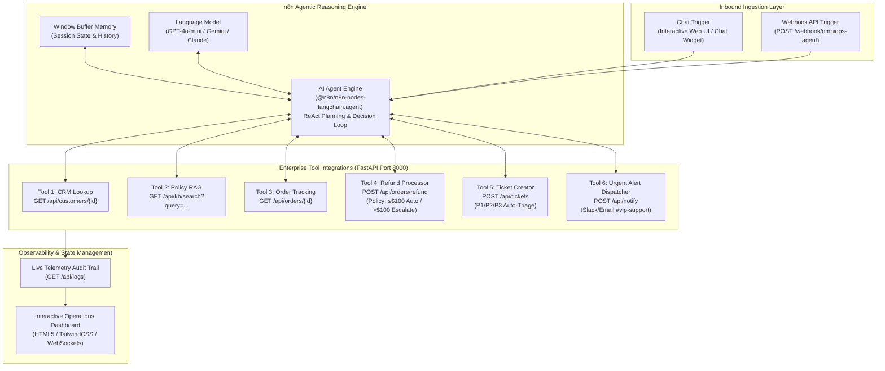

# 🤖 OmniOps: Autonomous Enterprise Support & Operations AI Agent (n8n + LangChain)

[](https://n8n.io)
[](https://www.python.org/)
[](https://fastapi.tiangolo.com/)
[](LICENSE)

An end-to-end, production-grade **Autonomous Multi-Tool Enterprise AI Agent** built on **n8n's LangChain AI Agent framework** and backed by a high-performance Python FastAPI service.

OmniOps autonomously resolves customer inquiries, queries knowledge base policies (RAG), tracks shipments, issues policy-constrained refunds, logs Jira/Zendesk escalation tickets, and dispatches real-time Slack alerts for VIP clients.

---

## 🏗️ System Architecture



---

## ✨ Key Capabilities & Enterprise Guardrails

1. **Autonomous ReAct Reasoning Loop**:
   - The agent iteratively reasons: **Observation ➔ Thought ➔ Action (Tool Call) ➔ Response**.
   - Gathers context *before* taking irreversible financial or operational actions.

2. **Deterministic Financial Guardrails**:
   - Automated refunds are strictly capped at **$100.00**.
   - If an order refund exceeds $100, the agent automatically escalates the case to a **Priority P2 Ticket** for Finance Manager review rather than rejecting or over-refunding.

3. **VIP Customer Protocol**:
   - Automatically detects VIP Enterprise and Executive Platinum customer tiers.
   - Automatically dispatches immediate high-priority alerts to the `#vip-support` channel on Slack.

4. **Multi-Channel Triggering**:
   - Supports both real-time **Chat Trigger** (for customer-facing widgets) and **Webhook API Trigger** (for headless integration with CRM, Slack bots, or mobile apps).

---

## 📁 Repository Structure

```
enterprise-omniops-n8n-agent/
├── backend/
│   ├── mock_api.py            # FastAPI enterprise service (CRM, KB, Orders, Tickets, Alerts)
│   ├── requirements.txt       # Python dependencies (fastapi, uvicorn, pydantic)
│   └── Dockerfile             # Container configuration for mock backend
├── workflows/
│   └── omniops_agent_workflow.json  # Complete 1-click importable n8n workflow JSON
├── frontend/
│   └── index.html             # Real-time interactive playground & telemetry dashboard
├── scripts/
│   └── test_agent.py          # Automated integration & policy guardrail test suite
├── docker-compose.yml         # Multi-container orchestration (n8n + Mock API)
├── .env.example               # Configuration template
├── run.bat                    # 1-click startup script for Windows
├── run.ps1                    # PowerShell startup script for Windows
└── README.md                  # System documentation
```

---

## 🚀 Quickstart Guide

### Option 1: 1-Click Launch (Windows)
Double-click `run.bat` or run in PowerShell:
```powershell
.\run.ps1
```
This automatically starts the backend API on `http://localhost:8000` and launches the interactive dashboard in your default browser.

---

### Option 2: Docker Compose (All-in-One)
To run both **n8n** and the **Enterprise Mock Backend** inside Docker:
```bash
docker-compose up -d
```
- **n8n Studio**: `http://localhost:5678`
- **Mock Enterprise API**: `http://localhost:8000`
- **API Docs (Swagger)**: `http://localhost:8000/docs`

---

### Option 3: Local Setup (Node.js & Python)
1. **Start the Mock Enterprise Backend**:
   ```bash
   python -m pip install -r backend/requirements.txt
   python -m uvicorn backend.mock_api:app --host 0.0.0.0 --port 8000 --reload
   ```

2. **Run n8n Locally**:
   ```bash
   npx n8n
   # or: npm install -g n8n && n8n start
   ```

---

## 📥 How to Import the Workflow into n8n

1. Open n8n in your browser at `http://localhost:5678`.
2. Click **Workflows** in the left sidebar, then click **Add Workflow** (or **+**).
3. In the top-right menu (three dots `...`), select **Import from File**.
4. Choose `workflows/omniops_agent_workflow.json` from this repository.
5. In the imported workflow:
   - Double-click the **OpenAI Chat Model** node (or replace it with **Google Gemini / Anthropic / Ollama**).
   - Enter your API Key credential.
6. Click **Save** and toggle the workflow to **Active**.
7. Test the agent by clicking the **Chat** icon at the bottom of the canvas!

---

## 🧪 Interactive Test Scenarios

| Scenario | User Prompt | Autonomous Action & Policy Guardrail |
| :--- | :--- | :--- |
| **1. Policy Query** | *"What is your refund policy on electronic items?"* | Calls `kb_policy_search`, retrieves article `POL-101`, and quotes the 30-day window and $100 auto-limit. |
| **2. CRM & Tracking** | *"Where is order #ORD-9021 for Sarah Connor (sarah@cyberdyne.com)?"* | Calls `crm_lookup` (verifies Sarah as VIP Enterprise), calls `order_status_lookup`, reports carrier tracking. |
| **3. Auto-Approved Refund** | *"Refund order #ORD-8812 ($45 cable) for customer CUST-101."* | Calls `process_order_refund`. Since $45 ≤ $100, refund is **instantly approved** with reference ID. |
| **4. High-Value Escalation** | *"I want a $350 refund on ORD-9021 because the unit overheats."* | Calls `process_order_refund`. Amount > $100 triggers **Escalation Ticket (P2)** for Finance Manager review. |
| **5. VIP Urgent Protocol** | *"Bruce Wayne: Security link ORD-9999 has transit delay issues!"* | Detects Executive Platinum tier; logs **P1 Urgent Ticket** and dispatches alert to `#vip-support` on Slack. |

---

## 🔬 Automated Verification Suite

Run the end-to-end test suite to verify all tools and policy rules:
```bash
python scripts/test_agent.py
```

Sample output:
```text
=================================================================
  OmniOps Enterprise Agentic Workflow - Verification Suite
=================================================================
  [PASS] 1. Backend API Health Check: OK
  [PASS] 2. Knowledge Base RAG: Retrieved 'Standard Refund & Return Policy' (Score: 0.75)
  [PASS] 3. CRM Customer Lookup: Verified 'Sarah Connor' (VIP Enterprise)
  [PASS] 4. Order Tracking: ORD-9021 status 'Delivered' via DHL Express
  [PASS] 5. Guardrail Test (Auto-Refund < $100): Status=APPROVED, RefID=REF-5C510C
  [PASS] 6. Guardrail Test (Escalation > $100): Status=REQUIRES_APPROVAL, Created Ticket=TICK-30A308
  [PASS] 7. Slack/Email Alert Dispatch: Alert ID=ALT-78B897
  [PASS] 8. Telemetry & Observability: 6 tool actions logged in audit trail.
=================================================================
  ALL CORE SYSTEM TESTS PASSED SUCCESSFULLY! (100% Green)
=================================================================
```

---

## 🛠️ Mock Enterprise API Reference

| Endpoint | Method | Purpose |
| :--- | :---: | :--- |
| `/api/customers/{identifier}` | `GET` | Fetches customer tier, email, active subscriptions, and order history |
| `/api/kb/search?query=...` | `GET` | Simulates RAG semantic policy search across returns, SLAs, and shipping |
| `/api/orders/{order_id}` | `GET` | Order status, carrier code, delivery timestamp, and return eligibility |
| `/api/orders/refund` | `POST` | Processes refunds with automated threshold policy enforcement ($100 limit) |
| `/api/tickets` | `POST` | Creates support and escalation tickets (P1/P2/P3) |
| `/api/notify` | `POST` | Simulates real-time Slack/Email alert dispatch |
| `/api/logs` | `GET` | Telemetry stream of all agent tool decisions and executions |

---

## 👨‍💻 Author

**Aizaz Ahmad**
- GitHub: [@aizazahmad736](https://github.com/aizazahmad736)
- LinkedIn: [linkedin.com/in/aizaz-ahmad-a24667349](https://www.linkedin.com/in/aizaz-ahmad-a24667349)
- Email: [aizazexforwardian@gmail.com](mailto:aizazexforwardian@gmail.com)
